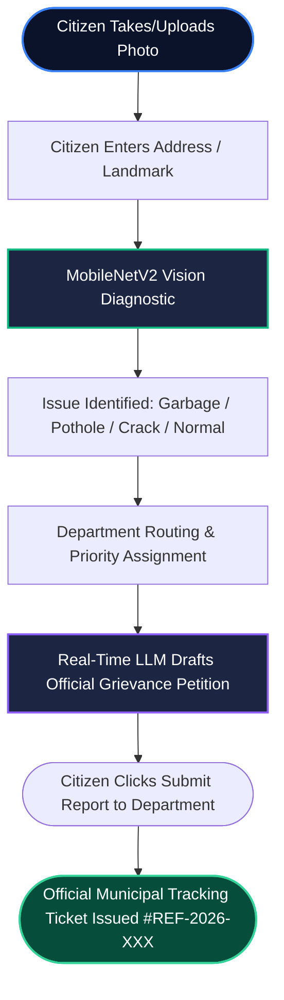

# CivicAlert AI — Public Infrastructure Issue Detection & Citizen Reporting Portal

[](https://www.python.org/)
[](https://www.tensorflow.org/)
[](https://streamlit.io/)
[](https://aistudio.google.com/)
[](LICENSE)
[](https://github.com/zahidjan01a/AI-Powered-Public-Infrastructure-Issue-Detection-and-Reporting-System.git)

An enterprise-grade civic technology platform that empowers citizens to photograph municipal infrastructure defects—such as **garbage accumulation**, **potholes**, and **road cracks**—enter a friendly location, automatically generate a professional grievance report addressed directly to the responsible municipal department, and submit it with an official reference tracking ticket.

---

## Table of Contents

1. [Citizen User Journey](#1-citizen-user-journey)
2. [Key Features](#2-key-features)
3. [Department Routing & SLAs](#3-department-routing--slas)
4. [System Architecture & Workflow](#4-system-architecture--workflow)
5. [AI Vision Model (MobileNetV2)](#5-ai-vision-model-mobilenetv2)
6. [Real-Time LLM Report Engine](#6-real-time-llm-report-engine)
7. [Installation & Quickstart](#7-installation--quickstart)
8. [Project Folder Structure](#8-project-folder-structure)
9. [How to Run the Application](#9-how-to-run-the-application)
10. [Evaluation Results](#10-evaluation-results)
11. [Author & GitHub](#11-author--github)

---

## 1. Citizen User Journey

```text
[Step 1: Ingestion]      Citizen uploads photo & enters address/landmark (e.g. "Main Market Road")
       │
[Step 2: AI Diagnosis]   MobileNetV2 classifies defect (Garbage, Pothole, Road Crack, Normal)
       │
[Step 3: Dept Routing]   Routes to specific authority (e.g., Solid Waste Management & Sanitation)
       │
[Step 4: Auto-Report]    Gemini LLM / Expert Engine drafts official grievance report
       │
[Step 5: Submission]     Citizen clicks "Submit Report" ──► Generates official Reference Ticket ID
                         (e.g., REF-2026-WMD-SAN-84920) with downloadable receipt & SLA timer
```

---

## 2. Key Features

- 📸 **Photo Upload & Automated Triage**: Upload photos of potholes, waste heaps, or pavement fissures.
- 📍 **Friendly Location Entry**: Enter a simple street address, area name, or neighborhood (no confusing latitude/longitude numbers).
- 🔍 **Background Geolocation**: If the camera photo contains GPS metadata, the system automatically verifies location authenticity.
- 🏛️ **Targeted Municipal Routing**: Automatically routes the complaint to the exact agency responsible for that infrastructure issue.
- 🤖 **Real-Time LLM Report Generation**: Uses Google Gemini (`gemini-1.5-flash`) to draft formal, professional grievance petitions addressed to the department head.
- 🚀 **Interactive "Submit to Department" Action**: One-click submission that issues an official Municipal Reference Ticket ID and logs priority status.
- 📥 **Official Receipt Download**: Download official submission receipts (.txt/.md) with tracking IDs and resolution SLAs.

---

## 3. Department Routing & SLAs

| Detected Defect | Responsible Municipal Department | Operating Unit | Target SLA |
| :--- | :--- | :--- | :---: |
| **Garbage** | **Municipal Solid Waste Management & Sanitation Department** | Rapid Sanitation & Waste Disposal Unit | **24 - 48 Hours** |
| **Pothole** | **Department of Public Works & Road Maintenance Division** | Emergency Pavement Repair Team | **24 - 72 Hours** |
| **Road Crack** | **Highways Engineering & Road Asset Maintenance Bureau** | Pavement Preservation Division | **5 - 7 Business Days** |
| **Normal** | **Municipal Civil Infrastructure Directorate** | Civil Asset Monitoring Registry | **Standard Cycle** |

---

## 4. System Architecture & Workflow



---

## 5. AI Vision Model (MobileNetV2)

- **Backbone**: MobileNetV2 (Pretrained on ImageNet, Frozen base)
- **Classification Head**: GlobalAveragePooling2D $\rightarrow$ Dropout(0.3) $\rightarrow$ Dense(128, ReLU) $\rightarrow$ Dropout(0.3) $\rightarrow$ Dense(4, Softmax)
- **Input Resolution**: $224 \times 224 \times 3$ RGB
- **Classes**: `0: garbage`, `1: normal`, `2: pothole`, `3: road_crack`
- **Total Parameters**: 2,751,438 (10.50 MB)
- **Benchmark Test Accuracy**: **98.33%** on unseen test images

---

## 6. Real-Time LLM Report Engine

- **Live AI Provider**: Google Gemini (`gemini-1.5-flash`, `gemini-2.0-flash`, `gemini-1.5-pro`) via direct REST integration.
- **Connection Test**: Sidebar includes a live **"⚡ Test Connection"** tool to verify your Gemini API key.
- **Smart Expert Engine**: Functions fully offline with zero setup required if no API key is provided.

---

## 7. Installation & Quickstart

```powershell
# 1. Clone repository
git clone https://github.com/zahidjan01a/AI-Powered-Public-Infrastructure-Issue-Detection-and-Reporting-System.git
cd AI-Powered-Public-Infrastructure-Issue-Detection-and-Reporting-System

# 2. Setup Virtual Environment
python -m venv .venv
.\.venv\Scripts\Activate.ps1

# 3. Install Dependencies
pip install -r requirements.txt

# 4. Launch Portal
streamlit run app/app.py
```

---

## 8. Project Folder Structure

```text
c:\AIProject/
│
├── README.md                           # Master documentation
├── requirements.txt                    # Validated production dependencies
├── .gitignore                          # Git tracking exclusions
├── .env.example                        # Template for optional API credentials
├── LICENSE                             # MIT License
│
├── app/
│   ├── app.py                          # CivicAlert citizen reporting portal
│   └── streamlit_app.py                # Entrypoint alias
│
├── src/                                # Modular source packages
│   ├── __init__.py                     # Package export
│   ├── preprocessing.py                # Image validation, RGB convert, resize
│   ├── prediction.py                   # Keras model loading & inference logic
│   ├── department_routing.py           # Municipal authority mapping, codes & SLAs
│   ├── gps_utils.py                    # Silent EXIF metadata detection
│   └── llm_recommendation.py           # Real-time Gemini citizen grievance engine
│
├── models/
│   ├── best_model.keras                # Trained MobileNetV2 model (11.6 MB)
│   └── class_names.txt                 # Class labels reference
│
├── notebooks/
│   ├── 01_dataset_preparation.ipynb    # Dataset extraction and audit
│   └── 02_train_mobilenetv2.ipynb      # Training & evaluation pipeline
│
├── data/
│   └── README.md                       # Data sourcing and balancing guide
│
├── assets/
│   └── screenshots/
│       └── README.md                   # UI visual asset instructions
│
├── reports/
│   └── README.md                       # Evaluation metrics and reports
│
└── presentation/
    └── AI_Public_Infrastructure_Detector.pptx  # Stakeholder presentation
```

---

## 9. How to Run the Application

```powershell
streamlit run app/app.py
```

Open `http://localhost:8501` in your browser.

---

## 10. Evaluation Results

| Dataset Split | Loss | Accuracy |
| :--- | :---: | :---: |
| **Training Set** | 0.1997 | **94.59%** |
| **Validation Set** | 0.0735 | **99.00%** |
| **Test Set** | **0.0415** | **98.33%** |

```text
              precision    recall  f1-score   support

     garbage       1.00      0.99      1.00       150
      normal       0.99      0.98      0.99       150
     pothole       0.99      1.00      0.99       149
  road_crack       0.99      1.00      1.00       150

    accuracy                           0.99       599
```

---

## 11. Author & GitHub

- **GitHub Repository**: [https://github.com/zahidjan01a/AI-Powered-Public-Infrastructure-Issue-Detection-and-Reporting-System.git](https://github.com/zahidjan01a/AI-Powered-Public-Infrastructure-Issue-Detection-and-Reporting-System.git)
- **License**: [MIT License](LICENSE)
